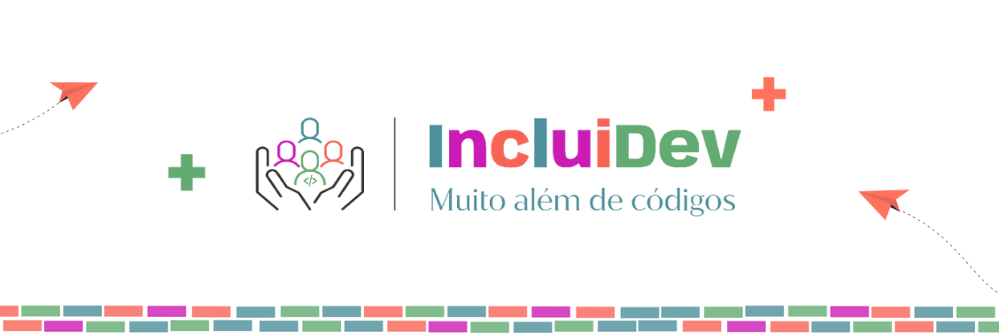

<h1 align=center>INCLUIDEV EMAIL API</h1>

<p align="center">
  
</p>

#
### DESCRICAO

#
### EQUIPE

<table>
  <tr>
  <td align="center">
      <a href="https://github.com/kaiquesouzasantos" title="Github Kaique">
        <br>
        <sub>
          <b>Kaique Souza Santos</b>
        </sub>
      </a>
    </td>
    <td align="center">
      <a href="https://github.com/HenryModesto" title="Github Henry">
        <br>
        <sub>
          <b>Henry Modesto De Jesus</b>
        </sub>
      </a>
    </td>
    <td align="center">
      <a href="https://github.com/IgorOdSilva" title="Github Igor">
        <br>
        <sub>
          <b>Igor Oliveira Da Silva</b>
        </sub>
      </a>
    </td>
    <td align="center">
      <a href="https://github.com/eulineaguiar" title="Github Aline">
        <br>
        <sub>
          <b>Aline Aguiar Da Silva</b>
        </sub>
      </a>
    </td>
    <td align="center">
      <a href="https://github.com/leoduarte14" title="Github Leonardo">
        <br>
        <sub>
          <b>Leonardo Duarte Pereira</b>
        </sub>
      </a>
    </td>
  </tr>
</table>

#
### TECNOLOGIAS

&nbsp;

#
### HOSPEDAGEM

```
http://###
```
